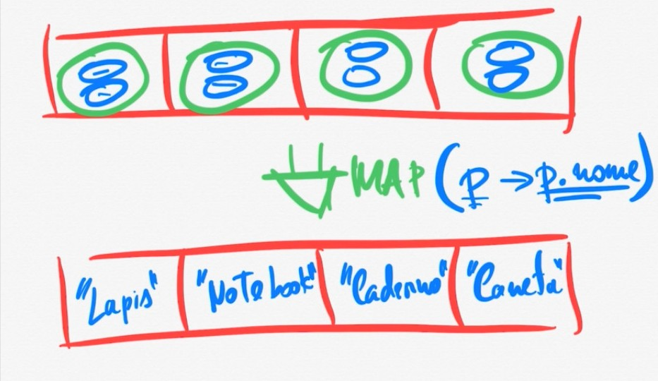

# Stream API
### O que é?
API do java para operações com coleções, ela abitrai grande parte do trabalho do desenvolvedor, fazendo com que o desenvolvedor foque na sua logica de negocio sem necessariamente se preocupar com a implementação de todo o codigo.

### operações com Stream
Existem mais de 30 operações e 7 staticos que podem ser feitas com Stream:

- **Build** - construtor de stram
- **Intermediarias** -  sempre retornam uma stream, que pode ser reutiliazado
- **Terminais** - geram algo diferente de um stram, podendo ser : void, double, int, String ...

### Tipos de Stream
- **Ordenada** 
- **Não ordenada**

- **sequencial** - processa a stream de forma sequencial
- **paralela** - executa o processamento de forma paralela. Internamente seram craidas varias linhas paralelas de processamento sem se preocupar com a implementação

#### Metodo MAP
MAP recebe uma lambda ou referencia de metodo que usa para transformar os elementos de uma stream gerando uma nova stream com os dados mapeados

exemplo: temos uma stream com produto (nome, preço), o map abaixo fornecera uma stream com os nomes dos produtos

desse modo criamos uma nova stream com os nomes dos produtos apenas.