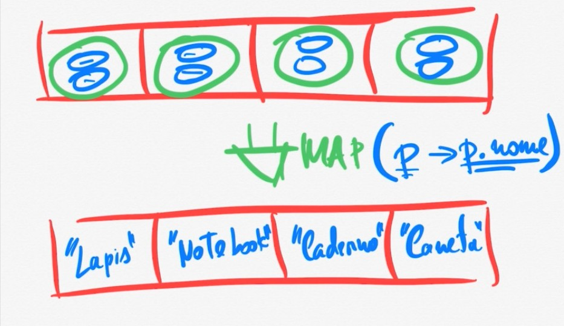
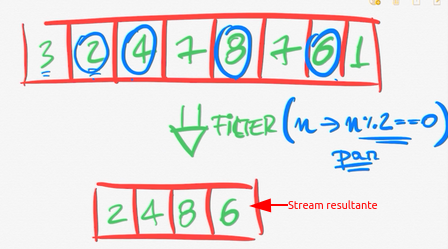
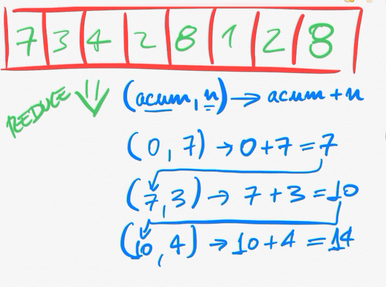

# Stream API

### O que é?

API do java para operações com coleções, ela abitrai grande parte do trabalho do desenvolvedor, fazendo com que o
desenvolvedor foque na sua logica de negocio sem necessariamente se preocupar com a implementação de todo o codigo.

---

### Operações com Stream

Existem mais de 30 operações e 7 staticos que podem ser feitas com Stream:

- **Build** - construtor de stram
- **Intermediarias** - sempre retornam uma stream, que pode ser reutiliazado
- **Terminais** - geram algo diferente de um stram, podendo ser : void, double, int, String, etc.

---

### Tipos de Stream

- **Ordenada**
- **Não ordenada**
- **sequencial** - processa a stream de forma sequencial
- **paralela** - executa o processamento de forma paralela. Internamente seram craidas varias linhas paralelas de
  processamento sem se preocupar com a implementação

---

### Metodos do Filter

#### Metodo MAP

MAP recebe uma lambda ou referencia de metodo que usa para transformar os elementos de uma stream gerando uma nova
stream com os dados mapeados. A nova stream tera o mesmo tamanho que a anterior

exemplo: temos uma stream com produto (nome, preço), o map abaixo fornecera uma stream com os nomes dos produtos

desse modo criamos uma nova stream com os nomes dos produtos apenas.

#### Metodo Filter

Filter como o propio nome sugere serve para filtrar dados, usamos para obter uma nova stream de dados filtrados com base
a um criterio. Se o criterio for verdadeioro fara parte da stream caso for falso não fara parte, caso todos os dados forem falsos sera um stream vazio.

Para implementar o Filter passamos como argumento a interface funcional Predicate, pois a expressão lambda retorna verdadeiro ou falso.

Exemplo: Filtrar os numeros pares de um Stream

#### Metodo Reduce

Consegue transforma uma stream de dados em algo completamente diferente. Nao precisa ter nem mesmo uma ligaçao direita com os tipos de cada um dos elementos.

Pode pegar um array e retornar um unico elemento, por exemplo a soma de todos os elementos do array.

Na sintaxe do Reduce (acumulado, n). n sao os valores da stream. O acumulador e passado para todos os elementos da stream durante a iterraçao, ja que na primeira nao teve a funçao anterior, podemos passar um valor inicial ou nao.

O acumulador nos da flexibilidade para definir o que vai ser, pode ser um objeto, array, tipo primitivo, etc.

Exemplo: calcular o valor total em uma Stream.

**OBS:** no final o reduce não gera outra stream, o reduce é um metodo terminal da API Stream.
